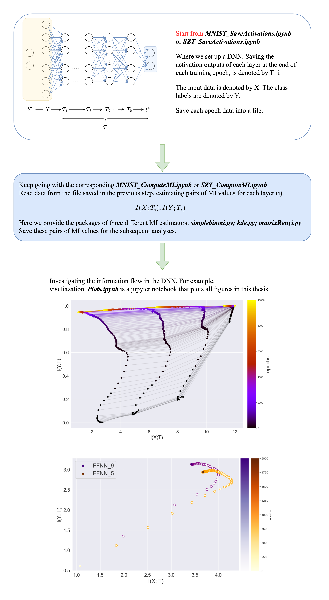

<h2 align="center">
Understanding the learning process in deep neural networks with Information Bottleneck
</h2>

## Introduction

This repository presents the application of the Information Bottleneck (IB) principle in deep learning. The IB principle suggests that the learning process of Deep Neural Networks (DNNs) can be analyzed by quantifying the mutual information (MI) between the layers, the input data, and the target variables. Here, Here we demonstrate how this quantification process can be implemented in deep feedforward neural networks (D-FFNN) with classification tasks.

## Set up
Please start by installing Miniconda with python. Python 3.11.5 was used here.
Please read the requirements.txt before you run this code.
NOTE: Especially if you are using a Mac with python 3.7 and your keras is 2.3.1, you may need to update the python or packgaes.

## Overall guidance for this repository
****

## Detailed explanation

* `MNIST_SaveActivations.ipynb` is a jupyter notebook that trains on MNIST and saves activation outputs when run on test set inputs for each epoch.
* `SZT_SaveActivations.ipynb` is a jupyter notebook that recreates the network and data from https://github.com/ravidziv/IDNNs and saves activations, for each epoch for a single trial.

* `loggingreporter.py` is a python file to save the activation values in DNNs at the end of each epoch. 
  
* `MNIST_ComputeMI.ipynb` is a jupyter notebook that loads the data files, computes MI values, and does the infoplane plots for data created using `MNIST_SaveActivations.ipynb`.
* `SZT_ComputeMI.ipynb` is a jupyter notebook that loads the data files created by `IBnet_SaveActivations.ipynb`, computes MI values, and does the infoplane plots.

* `simplebinmi.py` is a python file to compute the MI based on the binning-based estimator.
* `kde.py` is a python file to compute the MI based on the pairwise-diastance estimator. 
* `matrixRenyi.py` is a python file to compute the MI based on the matrix-based estimator.

* `Plots.ipynb` is a jupyter notebook that plots all figures in this thesis.
* `demo.py` is a simple script showing how to compute MI between X and Y, where Y = f(X) + Noise.

Please see the code and comments in the corresponding files for more details.

## Acknowledgement

- This code is partially based on [artemyk/ibsgd] (https://github.com/artemyk/ibsgd/tree/master).
- The package `matrixRenyi.py` referred the code from [SJYuCNEL] (https://github.com/SJYuCNEL/brain-and-Information-Bottleneck).

